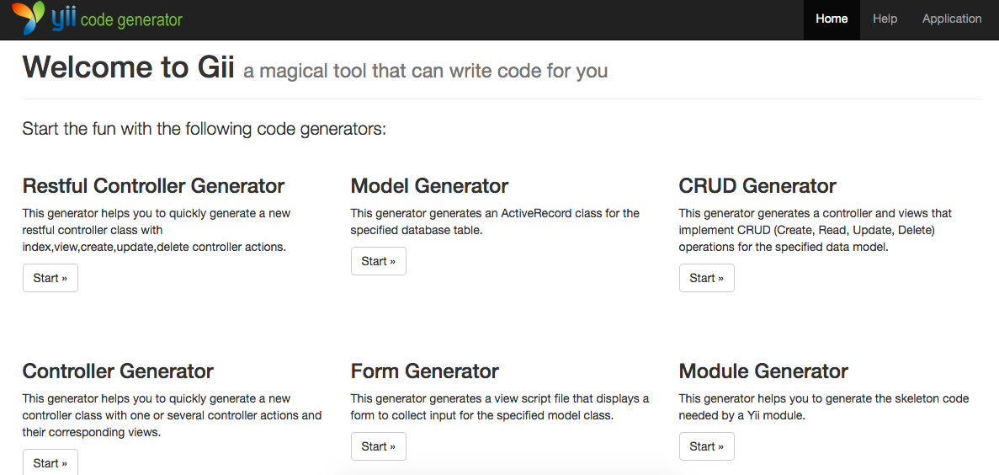
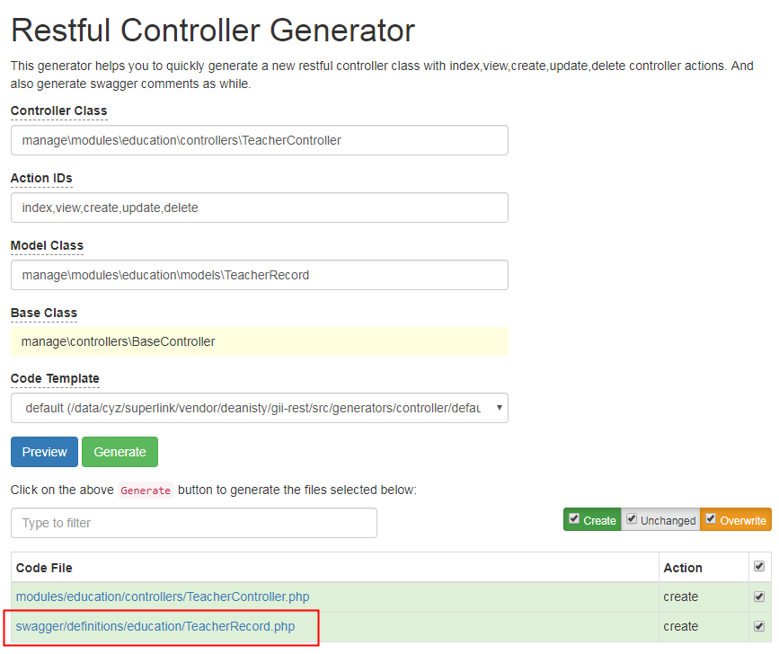

<p align="center">
    <h1 align="center">Restful extension for Gii</h1>
    <br>
</p>

This extension provides a Restful controller code generator for Gii, based on Yii 2. 
Support swagger API document generator as while.

Installation
------------

add

```
"deanisty/gii-rest": "~1.0.0"
```

to the require-dev section of your `composer.json` file.


Usage
-----

The extension based on Yii 2 and Gii, after installed you should [enable gii extension](https://www.yiiframework.com/doc/guide/2.0/en/start-gii), 
then add the extension as a generator to gii as follows:

```php
return [
    'bootstrap' => ['gii'],
    'modules' => [
        'gii' => [
            'class' => 'yii\gii\Module',
            'allowedIPs' => ['127.0.0.1', '*:*:*'],
            // here comes the addition configure for the extension
            'generators' => [ // generators
                'restController' => [ // our new rest generator
                    'class' => 'deanisty\generators\controller\Generator', // generator class name
                ]
            ]
        ],
        // ...
    ],
    // ...
];
```

You can then access Gii through the following URL:

```
http://localhost/path/to/index.php/gii
```

then you can see our new Restful controller generator:




Swagger Model
-----

This extension will also generate a swagger model file under the project directory where you controller file lives




The swagger model file path will follow the rule : 

```
{project_name}/swagger/definitions/{module_name}/{model_name}.php
```

where `module_name` is the name of module where the controller file belongs

and `model_name` is the name of model you typed in "Model Class" input.


Scenario
-----

As metioned in Yii framework, [Scenario](https://www.yiiframework.com/doc/guide/2.0/en/structure-models#scenarios) will be used for "Model Class".

This extension will detect scenario definitions inside you Model Class, and it will only use it for "create" action, thus these 
"required" fields of you Model Class will be noticed in Swagger comment. 

So if you need to generate these required fields in create action comment, you should do these things before generating : 

* Define Scenario for "create" and "update" ("update" scenario is not used for now)

```PHP
class YourModelClass extends \yii\db\ActiveRecord
{
    // 新增
    Const SCENARIO_CREATE = 'create';
    // 更新
    Const SCENARIO_UPDATE = 'update';

}
```


* then, rewrite `rules()` function of Model Class

```PHP
    /**
     * {@inheritdoc}
     */
    public function rules()
    {
        return [
            [['field_1', 'field_2', 'field_3', 'field_4',], 'required', 'on' => self::SCENARIO_CREATE,],
            [['images'], 'string'],
        ];
    }
```

Now, you can do the generating step to view your generated controller and swagger model files 


#### Notice: 

If you defined Create Scenario of Model Class and no fields setup to it using "on" property in rules() function,
the comment of create action will be generated but leave request parameters empty.


Read More
-----

*   [docs for swagger-php](https://github.com/zircote/swagger-php/blob/2.x/docs/Getting-started.md).
